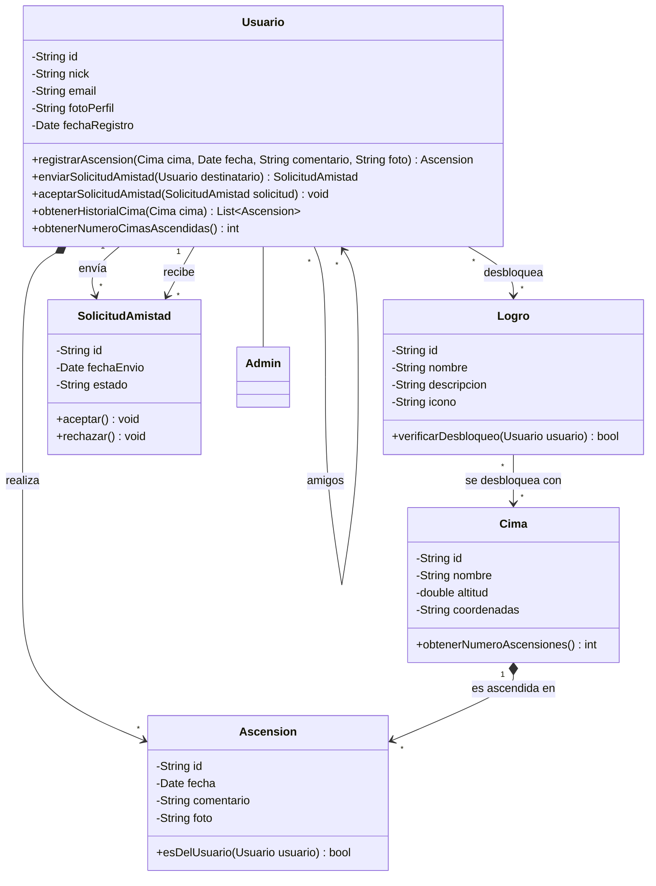

### 04.Diagrama de Clases

```mermaid
classDiagram
direction TB
    class Usuario {
	    -String id
	    -String nick
	    -String email
	    -String fotoPerfil
	    -Date fechaRegistro
	    +registrarAscension(Cima cima, Date fecha, String comentario, String foto) Ascension
	    +enviarSolicitudAmistad(Usuario destinatario) SolicitudAmistad
	    +aceptarSolicitudAmistad(SolicitudAmistad solicitud) void
	    +obtenerHistorialCima(Cima cima) List~Ascension~
	    +obtenerNumeroCimasAscendidas() int
    }
    class Cima {
	    -String id
	    -String nombre
	    -double altitud
	    -String coordenadas
	    +obtenerNumeroAscensiones() int
    }
    class Ascension {
	    -String id
	    -Date fecha
	    -String comentario
	    -String foto
	    +esDelUsuario(Usuario usuario) bool
    }
    class Logro {
	    -String id
	    -String nombre
	    -String descripcion
	    -String icono
	    +verificarDesbloqueo(Usuario usuario) bool
    }
    class SolicitudAmistad {
	    -String id
	    -Date fechaEnvio
	    -String estado
	    +aceptar() void
	    +rechazar() void
    }
    class Admin {
    }

    Usuario "1" *--> "*" Ascension : realiza
    Cima "1" *--> "*" Ascension : es ascendida en
    Usuario "1" --> "*" SolicitudAmistad : envía
    Usuario "1" --> "*" SolicitudAmistad : recibe
    Usuario "*" --> "*" Usuario : amigos
    Usuario "*" --> "*" Logro : desbloquea
    Logro "*" --> "*" Cima : se desbloquea con
    Usuario -- Admin

```
