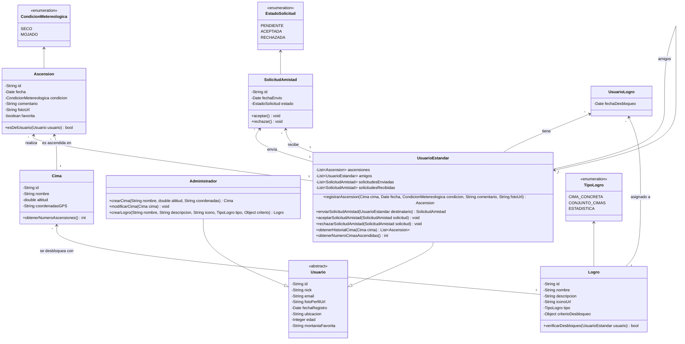

### 04.Diagrama de Clases

```mermaid
classDiagram
    direction BT

    class Usuario {
        <<abstract>>
        -String id
        -String nick
        -String email
        -String fotoPerfilUrl
        -Date fechaRegistro
        -String ubicacion
        -Integer edad
        -String montaniaFavorita
    }

    class UsuarioEstandar {
        -List~Ascension~ ascensiones
        -List~UsuarioEstandar~ amigos
        -List~SolicitudAmistad~ solicitudesEnviadas
        -List~SolicitudAmistad~ solicitudesRecibidas
        +registrarAscension(Cima cima, Date fecha, CondicionMetereologica condicion, String comentario, String fotoUrl) Ascension
        +enviarSolicitudAmistad(UsuarioEstandar destinatario) SolicitudAmistad
        +aceptarSolicitudAmistad(SolicitudAmistad solicitud) void
        +rechazarSolicitudAmistad(SolicitudAmistad solicitud) void
        +obtenerHistorialCima(Cima cima) List~Ascension~
        +obtenerNumeroCimasAscendidas() int
    }

    class Administrador {
        +crearCima(String nombre, double altitud, String coordenadas) Cima
        +modificarCima(Cima cima) void
        +crearLogro(String nombre, String descripcion, String icono, TipoLogro tipo, Object criterio) Logro
    }

    class Cima {
        -String id
        -String nombre
        -double altitud
        -String coordenadasGPS
        +obtenerNumeroAscensiones() int
    }

    class Ascension {
        -String id
        -Date fecha
        -CondicionMetereologica condicion
        -String comentario
        -String fotoUrl
        -boolean favorita
        +esDelUsuario(Usuario usuario) bool
    }

    class Logro {
        -String id
        -String nombre
        -String descripcion
        -String iconoUrl
        -TipoLogro tipo
        -Object criterioDesbloqueo
        +verificarDesbloqueo(UsuarioEstandar usuario) bool
    }

    class SolicitudAmistad {
        -String id
        -Date fechaEnvio
        -EstadoSolicitud estado
        +aceptar() void
        +rechazar() void
    }

    class UsuarioLogro {
        -Date fechaDesbloqueo
    }

    %% Enumeraciones
    class CondicionMetereologica {
        <<enumeration>>
        SECO
        MOJADO
    }

    class EstadoSolicitud {
        <<enumeration>>
        PENDIENTE
        ACEPTADA
        RECHAZADA
    }

    class TipoLogro {
        <<enumeration>>
        CIMA_CONCRETA
        CONJUNTO_CIMAS
        ESTADISTICA
    }

    %% Relaciones
    Usuario <|-- UsuarioEstandar
    Usuario <|-- Administrador

    UsuarioEstandar "1" --> "*" Ascension : realiza
    Cima "1" --> "*" Ascension : es ascendida en

    UsuarioEstandar "1" --> "*" SolicitudAmistad : envía
    UsuarioEstandar "1" --> "*" SolicitudAmistad : recibe

    UsuarioEstandar "1" --> "*" UsuarioEstandar : amigos

    UsuarioEstandar "1" --> "*" UsuarioLogro : tiene
    Logro "1" --> "*" UsuarioLogro : asignado a

    %% Relaciones con enumeraciones
    SolicitudAmistad --> EstadoSolicitud
    Logro --> TipoLogro
    Ascension --> CondicionMetereologica

    %% Relación Logro-Cima para logros de cima concreta
    Logro "1" --> "*" Cima : se desbloquea con
```